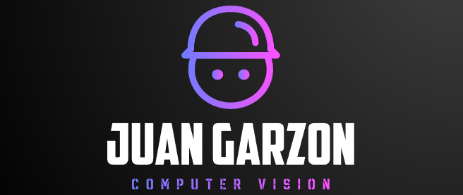
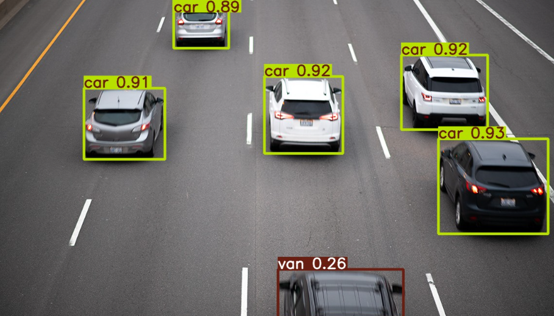
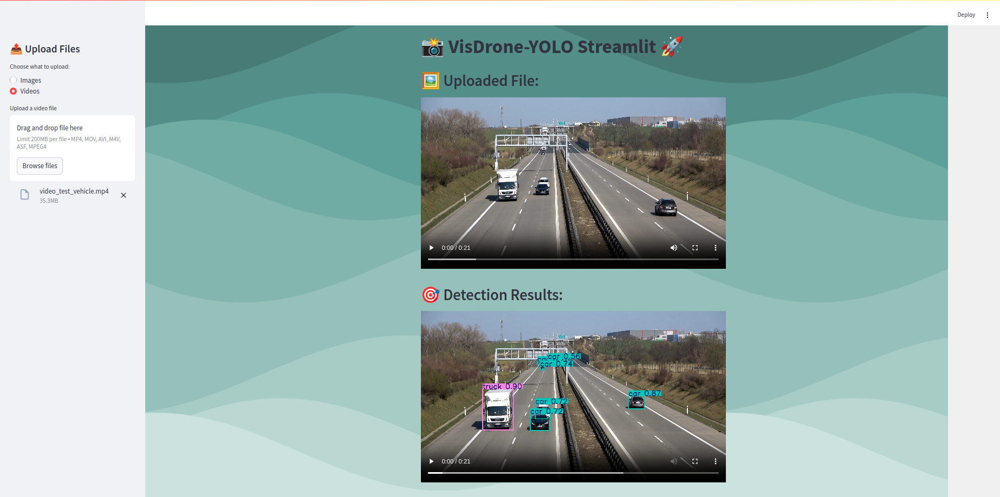
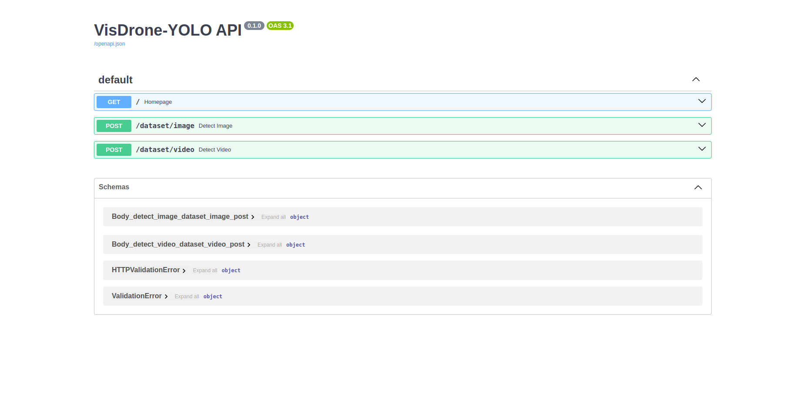

<h1 align="center">📸 VisDrone: YOLO11 Detection 🎥</h1>

<div align="center">
  
</div>

---

<p align="center">Developed by <a href="https://www.linkedin.com/in/juancarlosgarzon/">Juan Carlos Garzon</a></p>

<h3 align="center">Demo IMAGE</h3>

<div align="center">
  
</div>

---

<h3 align="center">Demo VIDEO</h3>

https://github.com/user-attachments/assets/12c75460-b6d5-48a9-84a6-ce851715ffb8

---

## VisDrone-Dataset

Drones, or general UAVs, equipped with cameras have been fast deployed to a wide range of applications, including agricultural, aerial photography, fast delivery, and surveillance. Consequently, automatic understanding of visual data collected from these platforms become highly demanding, which brings computer vision to drones more and more closely. We are excited to present a large-scale benchmark with carefully annotated ground-truth for various important computer vision tasks, named VisDrone, to make vision meet drones. The VisDrone2019 dataset is collected by the AISKYEYE team at Lab of Machine Learning and Data Mining , Tianjin University, China. The benchmark dataset consists of 288 video clips formed by 261,908 frames and 10,209 static images, captured by various drone-mounted cameras, covering a wide range of aspects including location (taken from 14 different cities separated by thousands of kilometers in China), environment (urban and country), objects (pedestrian, vehicles, bicycles, etc.), and density (sparse and crowded scenes). Note that, the dataset was collected using various drone platforms (i.e., drones with different models), in different scenarios, and under various weather and lighting conditions. These frames are manually annotated with more than 2.6 million bounding boxes of targets of frequent interests, such as pedestrians, cars, bicycles, and tricycles. Some important attributes including scene visibility, object class and occlusion, are also provided for better data utilization.

### Download

Task 1: Object Detection in Images
VisDrone-DET dataset

[VisDrone Dataset](https://github.com/VisDrone/VisDrone-Dataset)

---

## Project Goal

The main goal of this project is to create a detection system using the **VisDrone** dataset. This system is built using the YOLO11m model from **Ultralytics**, which has been carefully trained and fine-tuned to detect a wide range of objects, including **pedestrians**, **people**, **bicycles**, **cars**, **vans**, **trucks**, **tricycles**, **awning-tricycles**, **buses**, and **motorcycles**. The model was trained using the VisDrone dataset, making it well-suited to identify and classify these objects in real-world situations.

Once the training and fine-tuning were completed, the model was deployed using the **FastAPI** framework, enabling seamless image and video processing for real-time object detection. Additionally, a user-friendly **Streamlit** web interface was built, allowing users to upload images and videos for immediate processing and detection results.

This project combines the latest techniques in deep learning, API development**, and web interface design to provide an intuitive, easy-to-use solution for object detection.

---

### Key Components:
- **Dataset**: VisDrone
- **Model**: YOLO11m (Fine-Tuned with VisDrone Dataset)
- **API**: FastAPI for real-time inference and deployment
- **Web Interface**: Streamlit for intuitive image and video upload and processing

---

### Objects Detected:
- Pedestrian
- People
- Bicycle
- Car
- Van
- Truck
- Tricycle
- Awning-Tricycle
- Bus
- Motorcycle

---

## Getting Started

To get started with the **VisDrone: YOLO11 Detection** project, follow the steps below. The model was trained using **Visual Studio Code**, running on **Linux Ubuntu**, with an **NVIDIA GeForce RTX 4080 GPU**. 

### Prerequisites
Before running the application, ensure you have the following installed:
- **Conda** (for creating and managing environments)
- **Visual Studio Code** (or any IDE for running Python)
- **NVIDIA Drivers** and **CUDA** (for GPU acceleration)

### Steps to Set Up

1. **Create a Conda environment**:
   
   Start by creating a Conda environment. You can name it whatever you like (e.g., `visdrone_env`). Open a terminal and run:

   ```bash
   conda create --name visdrone_env python=3.10
    ```
   Replace visdrone_env with your preferred environment name.

2. **Activate the environment**:

   Once the environment is created, activate it with:
  
   ```bash
   conda activate visdrone_env
   ```

3. **Install dependencies**:
    
   Next, install the necessary libraries by using the requirements.txt file. This file includes all the required dependencies for running the project. Run the following command:
    
   ```bash
   pip install -r requirements.txt
   ```
    
4. **Run the FastAPI application**:
    
   After the dependencies are installed, you can start the FastAPI server to serve the model. Run the following command:
    
   ```bash
   uvicorn VisDrone_api:app --reload
   ```
   
   This will start the API, allowing you to process images and videos for drone detection.
    
5. **Launch the Streamlit interface**:
    
   Finally, to interact with the model via a web interface, run the Streamlit application:
    
   ```bash
   streamlit run VisDrone_app.py
   ```
   
   This will open a browser window with the interface, where you can upload images and videos for detection.

---

## Screenshots

Below are screenshots of the project's user interface, showcasing both the **Streamlit** web application and the **FastAPI** interface:

### Streamlit Interface
The Streamlit application provides a user-friendly interface for uploading images and videos for object detection.



---

### FastAPI Interface
The FastAPI interface enables interaction with the detection system via API endpoints for processing images and videos.



---

## Citation

```bash
@article{zhu2021detection,
  title={Detection and tracking meet drones challenge},
  author={Zhu, Pengfei and Wen, Longyin and Du, Dawei and Bian, Xiao and Fan, Heng and Hu, Qinghua and Ling, Haibin},
  journal={IEEE Transactions on Pattern Analysis and Machine Intelligence},
  volume={44},
  number={11},
  pages={7380--7399},
  year={2021},
  publisher={IEEE}
}
```
